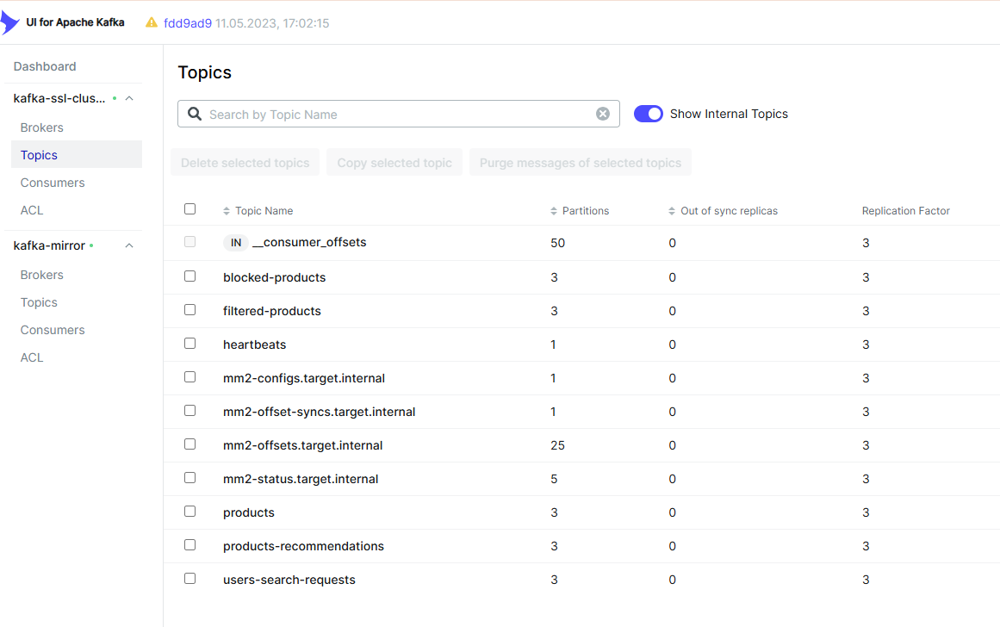
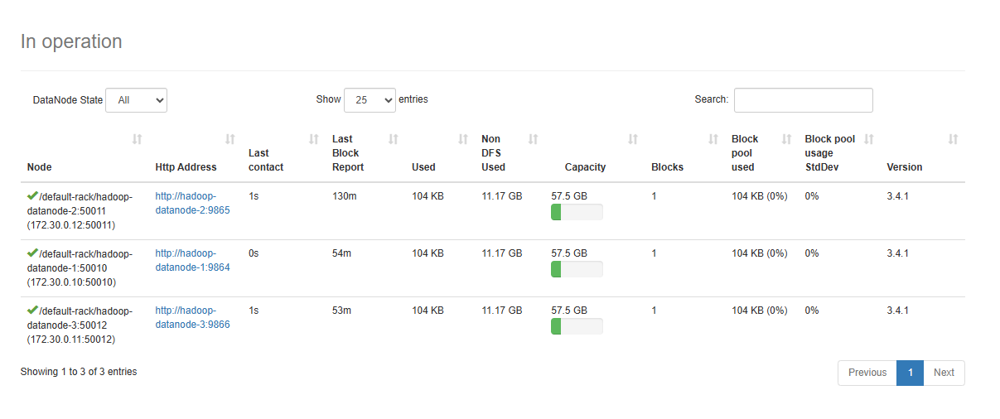

# Финальный проект

Состав системы:

## AnalyticService
Сервис предназначен для получения из Kafka поисковых запросов о товарах и запись этих запросов в Apache Hadoop.
Также сервис, с помощью Apache Spark, выполняет анализ поисковых запросов, формирует рекомендацию по наиболее часто запрашиваемым
продуктам и отправляет ее в Kafka в топик products-recommendations.

## Shop api
В качестве источника новых товаров используется механизм чтения информации из текстового файла и ее отправки в Kafka в топик
products с помощью консольной утилиты kafka-console-producer из состава дистрибутива Kafka.
Команды отправки сообщений указаны в модуле Infrastructure/ProduceCommand.txt
Формат записи товаров в файле см. Infrastructure/Products.txt

## ProductsFilter
Данный сервис выполняет потоковую обработку товаров, поступающих в топик products, сверяет их с перечнем запрещенных товаров
из топка blocked-products и отфильтрованные товары отправляет в топик filtered-products.
С помощью ввода в консоли можно добавлять наименования запрещенных товаров и они будут отправлены в соответсвующий топик.

## ClientApi
Данный сервис позволяет выполнить поиск доступного товара, а также получить рекомендацию товаров, с помощью ввода команд
в консоль. Сервис содержит свой контекст данных, с товарами и рекомендациями, который наполняется из kafka.

В системе также используются:
- Два кластера Kafka по три брокера в каждом. Данные первого кластера непрерывно реплицируются на
второй, с помощью утилиты kafka-mirrormaker. Доступ к брокерам осуществляется с помощью SASL_SSL при наличии
соответствующих сертификатов и при наличии доступа ACL.

- Кластер Hadoop из трех datanode для хранения поисковых запросов из mirror кластера kafka.

