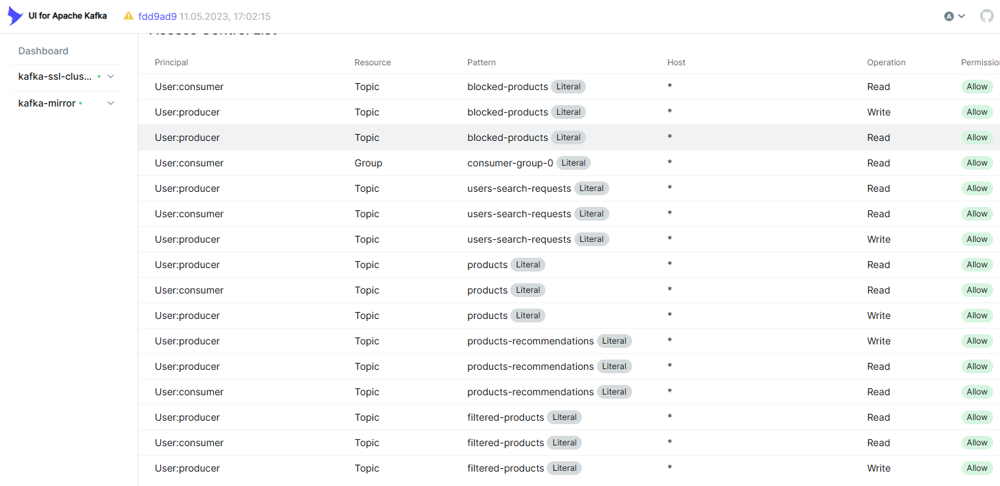
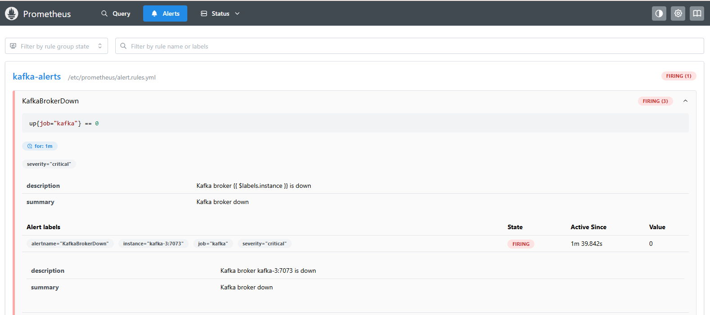
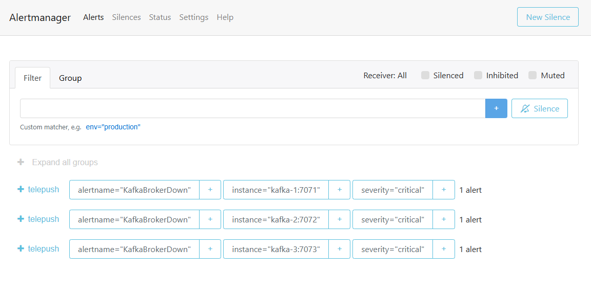
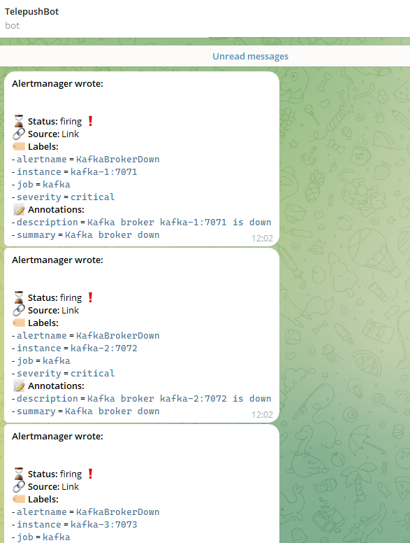
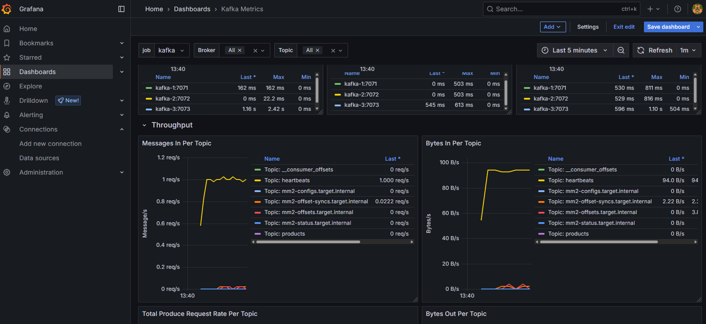
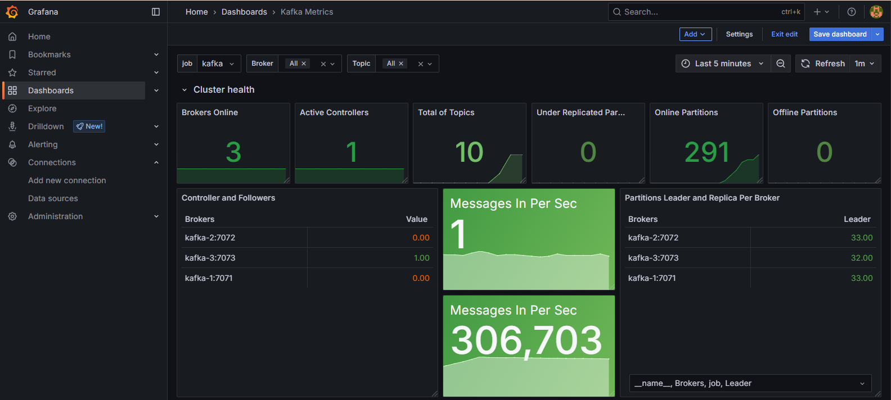

# Финальный проект

## Состав системы:

### AnalyticService
Сервис предназначен для получения из Kafka поисковых запросов о товарах и запись этих запросов в Apache Hadoop.
Также сервис, с помощью Apache Spark, выполняет анализ поисковых запросов, формирует рекомендацию по наиболее часто запрашиваемым
продуктам и отправляет ее в Kafka в топик products-recommendations.

### Shop api
В качестве источника новых товаров используется механизм чтения информации из текстового файла и ее отправки в Kafka в топик
products с помощью консольной утилиты kafka-console-producer из состава дистрибутива Kafka.
Команды отправки сообщений указаны в модуле ./Infrastructure/ProduceCommand.txt
Формат записи товаров в файле см. ./Infrastructure/Products.txt

### ProductsFilter
Данный сервис выполняет потоковую обработку товаров, поступающих в топик products, сверяет их с перечнем запрещенных товаров
из топка blocked-products и отфильтрованные товары отправляет в топик filtered-products.
С помощью ввода в консоли можно добавлять наименования запрещенных товаров и они будут отправлены в соответсвующий топик.

### ClientApi
Данный сервис позволяет выполнить поиск доступного товара, а также получить рекомендацию товаров, с помощью ввода команд
в консоль. Сервис содержит свой контекст данных, с товарами и рекомендациями, который наполняется из kafka.

### В системе также используются:
- Два кластера Kafka по три брокера в каждом. Данные первого кластера непрерывно реплицируются на
второй, с помощью утилиты kafka-mirrormaker. Доступ к брокерам осуществляется с помощью SASL_SSL при наличии
соответствующих сертификатов и при наличии доступа ACL.

Настроенные права доступа:

- Кластер Hadoop из трех datanode для хранения поисковых запросов из mirror кластера kafka.

- Связка prometheus/alertmanager/grafana для сбора метрик, визуализации характеристик кластера, а также повышения скорости реагирования
на проблемы с кластером за счет отправки алертов в telegram.

Метрики основного кластера:

## Порядок разворачивания:
1. Скопируйте содержимое папки ./Infrastructure/full на машину на которой планируется разворачивание инфраструктуры;
2. Осуществите подъем контейнеров с помощью команды docker compose up -d;
3. Убедитесь что разворачивание прошло успешно и в логах каждого из сервисов нет ошибок с помощью команды docker logs <container_name>
4. Перейдите в развернутую grafana http://<ip_machine>:3000/ и смените дефолтный пароль. Подключите источник данных prometheus http://<ip_machine>:9090
5. Из папки ./Infrastructure загрузите dashboard KafkaDashboard.json
6. Убедитесь, что в grafana отображаются метрики кластера kafka;
7. В основном кластере Kafka создайте топики products, filtered-products, blocked-products, products-recommendation, users-search-requests
Топики можно создать, например с помощью kafka-ui. Number of partitions -3, Min In Sync Replicas -3, Replication Factor - 3;
8. Убедитесь, что указанные топики реплицируются на mirror кластер;
9. Назначьте права доступа ACL с помощью команд, указанных в ./Infrastructure/acl-commands.txt;
10. С помощью pgadmin подключите postgres и убедитесь, что была создана база client-api, при отсутствии создайте ее;
11. Соберите проект mvn clean install;
12. На машину, где будут использоваться приложения AnalyticsService, ClientApi, ProductsFilter требуется установить сертификаты из ./Infrastructure/full/certs;
13. В DNS машины из. п. 10 необходимо указать ip адрес машины, где разворачивалась инфраструктура.
    <ip_machine> kafka-1
    <ip_machine> kafka-2
    <ip_machine> kafka-3
    <ip_machine> kafka-4
    <ip_machine> kafka-5
    <ip_machine> kafka-6
    <ip_machine> hadoop-namenode
    <ip_machine> hadoop-datanode-1
    <ip_machine> hadoop-datanode-2
    <ip_machine> hadoop-datanode-3;
14. Запустите сервисы java -jar AnalyticsService-1.0-SNAPSHOT.jar, java -jar ClientApi-1.0-SNAPSHOT.jar, java -jar ProductsFilter-1.0-SNAPSHOT.jar,
    ProductsFilter-1.0-SNAPSHOT.jar. Предварительно откорректируйте application.properties для каждого приложения, если это необходимо;
15. Попробуйте отправить товары с помощью файла и консольной утилиты kafka-console-producer.bat, предварительно скачав ее https://kafka.apache.org/downloads ;
16. Убедитесь, что товары попадают в топик filtered-products;
17. В приложении ProductsFilter добавьте товар в блокируемые, с помощью ввода имени в консоль;
18. Повторите п. 13 с запрещенным товаром. Убедитесь, что товар не попал в filtered-products;
19. С помощью ClientApi поищите товар минимум 3 раза;
20. С помощью ClientApi получите рекомендацию товара, выбрав соответствующую в консоли команду.

## Выводы:
В ходе выполнения работы была реализована система электронной коммерции. Развернут SASL_SSL кластер, выполнена его репликация на mirror кластер.
Реализована потоковая обработка данных, фильтрация товаров. Выполнен вариант простейшей аналитики и выдачи рекомендаций товаров.
Организован мониторинг системы, визуализация метрик, а также алертинг в телеграм.
Настоящая система выполнена с рядом упрощений, но в случае последующих доводок может являться основой production системы для электронной коммерции.