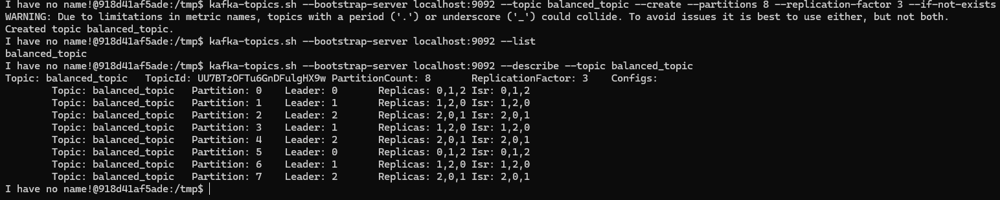
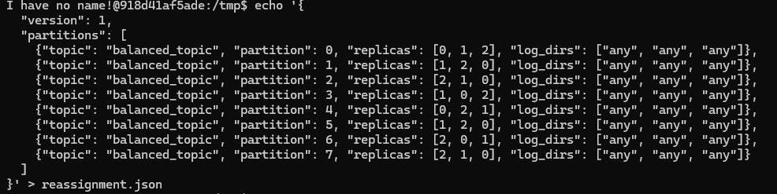
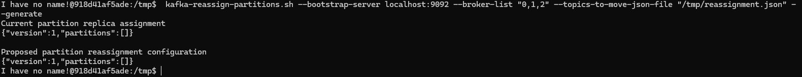
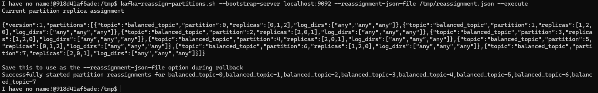
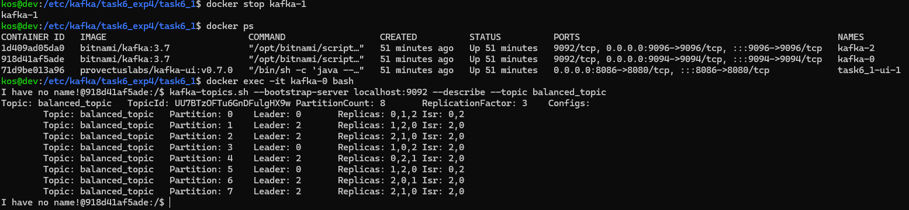
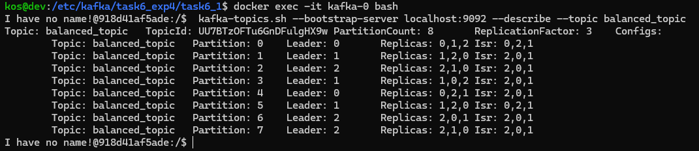
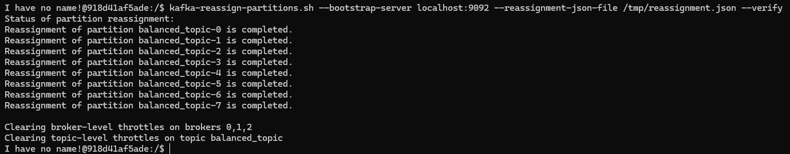

Задание 1. Балансировка партиций и диагностика кластера. Отчет о выполнении
1. C помощью Infrastructure/Task6_1/docker-compose.yml поднята инфраструктура.
2. Создан топик:

3. Подготовлен файл reassignment.json:

4. Сгенерирован план:

5. Выполнено переназначение:

6. Останавливаем брокер kafka-1:

7. Поднимаем брокер:

8. Проверим:

Выводы:
- При остановке одного из брокеров возникли несинхронизированные реплики, в которых дынные могли устареть;
- Лидеры распределились неравномерно, что может привести к повышенной нагрузке на брокеры;
- При восстановлении брокера произошла автоматическая перебалансировка и лидеры распределились более равномерно, не осталось
несинхронизованных реплик. Это происходит по тому, что опция auto.leader.rebalance.enable = true по умолчанию. В production
среде ее иногда рекомендуется ставить в false, и использовать для более эффективного распределения нагрузки по брокерам раpличиные утилиты (например, Cruise Control).

Задание 2. Настройка защищённого соединения и управление доступом. Инструкция по проверке
1. Скопируйте содержимое модуля Infrastructure/Task6_2 на машину, на которой планируется развернуть кластер kafka.
2. Разверните кластер кафки командой 'sudo EXTERNAL_IP=localhost docker compose up -d'
Если кластер будет разворачиваться на отдельном сервере, то вместо localhost укажите ip адрес сервера.
3. Убедитесь, что в логах развернутых контейнеров нет ошибок - с помощью команды docker logs <container_name>
4. Создайте топики topic-1 и topic-2. Для простоты можно использовать развернутый kafka ui: http://localhost:8085/ui/clusters/kafka-ssl-cluster/all-topics/create-new-topic
5. Зайдите внутрь контейнера kafka-0.
6. Выполните команды указанные в файле acl.commands
7. Убедитесь, что права назначены успешно. Можно использовать kafka-ui: http://localhost:8085/ui/clusters/kafka-ssl-cluster/acl
На странице Access Control List должны быть видны назначенные права.
8. Добавьте сертификаты ca.pem, kafka-0.crt, kafka-1.crt, kafka-2.crt на клиентской машине в доверенные корневые центры сертификатов,
а также в cacerts с помощью команд, пример для ca.pem:
keytool -import -trustcacerts -keystore "$JAVA_HOME\lib\security\cacerts" -alias ca -file .\ca.pem
9. Соберите приложение App с помощью mvn clean install
10. При необходимости измените application.properties приложения App.
Если кластер развернут на localhsot, то в kafka.cluster.bootstrap-servers также используйте localhost.
Если кластер развернут на отдельном сервере, то настройку оставьте без изменений и добавьте в "C:\Windows\System32\drivers\etc\hosts"
<ваш EXTERNAL_IP> kafka-0
<ваш EXTERNAL_IP> kafka-1
<ваш EXTERNAL_IP> kafka-2
11. Запустите приложение. Убедитесь что продьюсеры отправили в topic-1 и topic-2 сообщения вида 'Тестовое сообщение в топик 1/2'
12. Спродьюсируйте сообщения в topic-1 и topic-2 с помощью kafka-ui. Убедитесь, что консьюминг прошел только из topic-1. Ищите в логах запись: Получено сообщение...