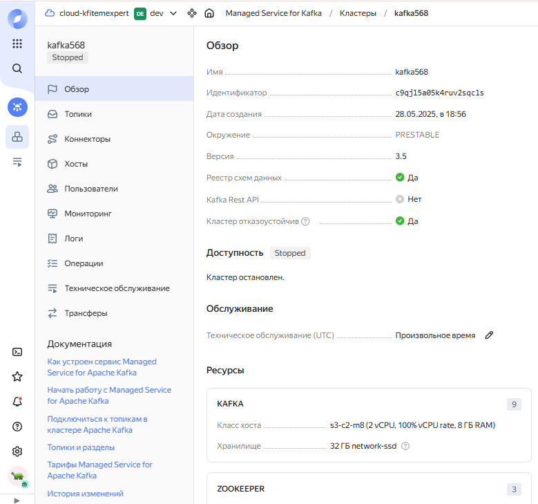
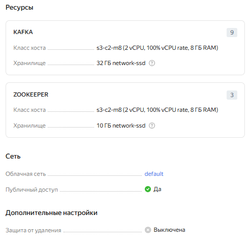
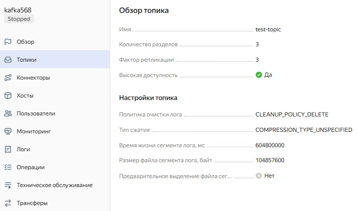
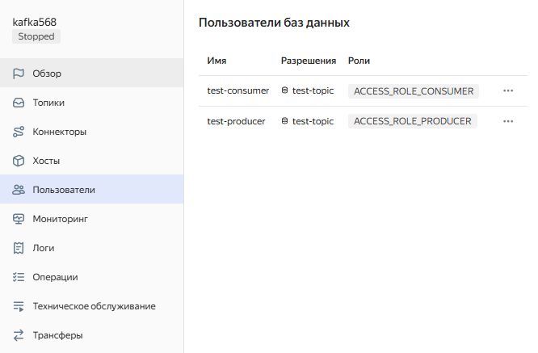
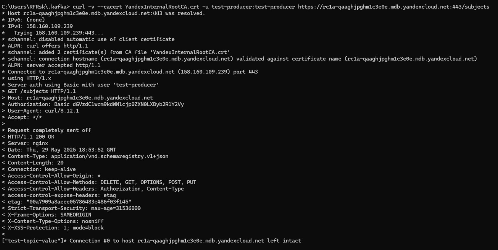
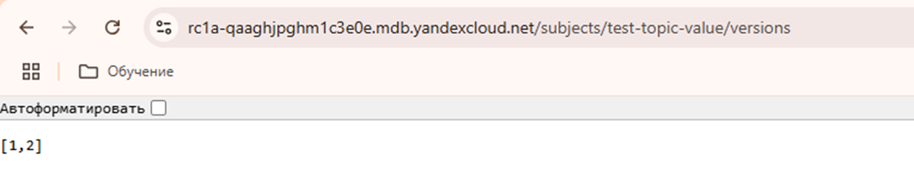
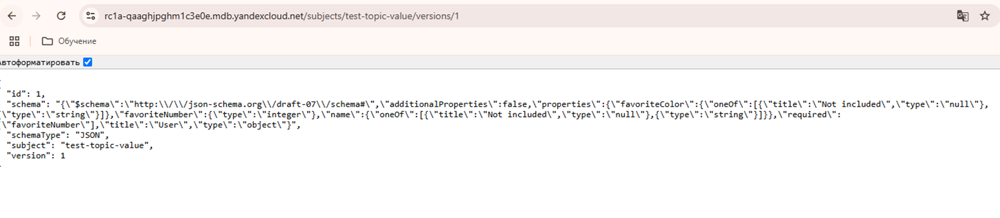
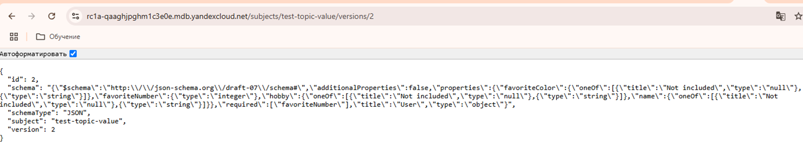
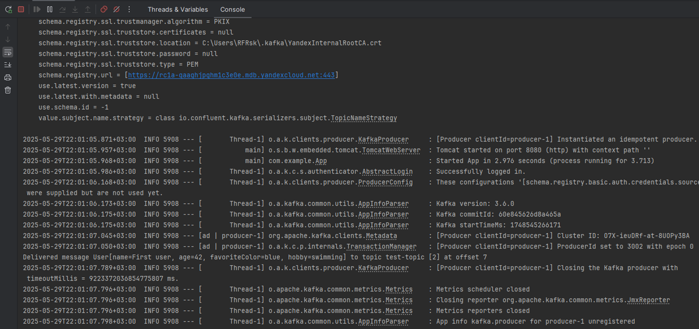
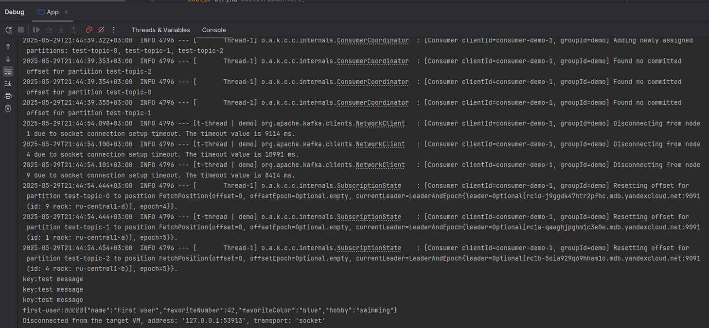

Задание 1.Развёртывание и настройка Kafka-кластера в Yandex Cloud

В ходе выполнения работы, был развернут кластер 'Managed Service for Kafka' из 3 брокеров в Yandex Cloud.

Характеристики кластера:

- Был создан топик, настроено время жизни сегмента лога, размер файла сегмента:

- Были созданы пользователи, им назначены права на топик test-topic:

- Зарегистрирована схема данных:

- Ответы get запросов схем:

- Были реализованы простой консьюмер и продьюсер, читающий и записывающие соответственно данные в кластер, развернутый в Yandex Cloud.
- Лог продсьюсера:

- Лог консьюмера:

Выводы: Yandex Cloud предлагает удобные и мощные инструменты с простым и понятным UI для разворачивания инфраструктуры в облаке.
Данные инструменты существенно сокращают трудозатраты на разворачивание, сопровождение и поддержку систем, а также сокращают требования
к квалификации задействованного в обслуживании систем персонала.