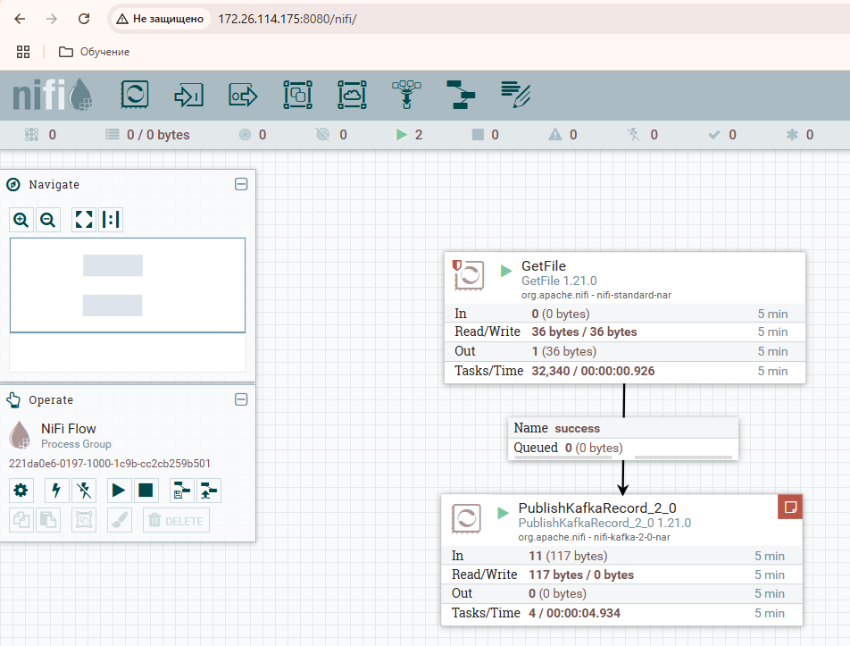
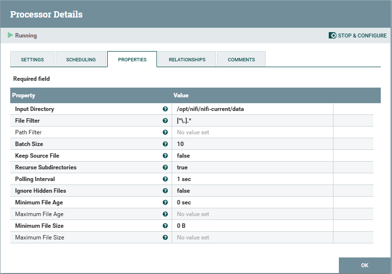
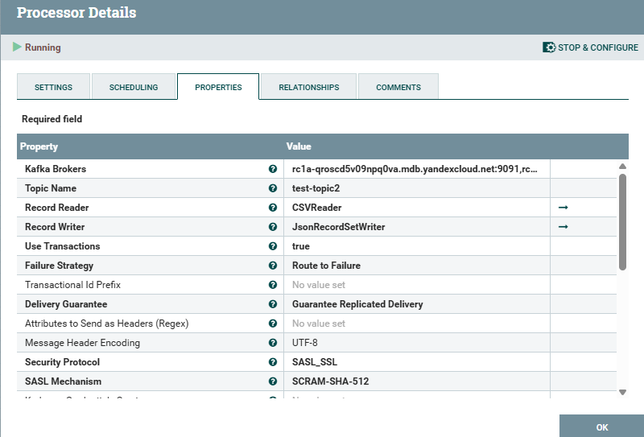
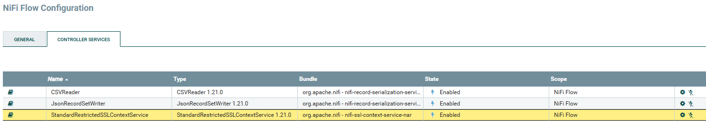
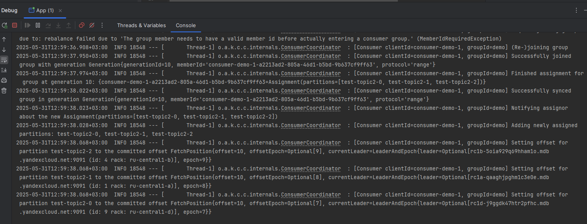
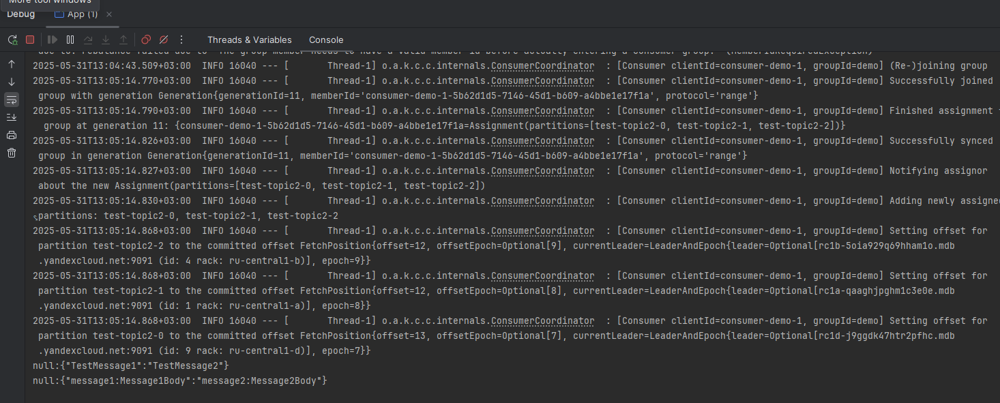
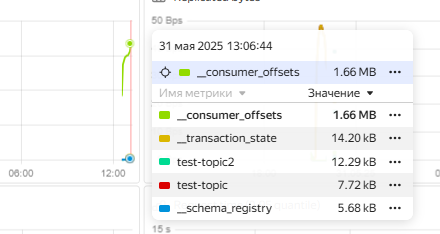

## Задание 1.Развёртывание и настройка Kafka-кластера в Yandex Cloud

В ходе выполнения работы, был развернут кластер 'Managed Service for Kafka' из 3 брокеров в Yandex Cloud.

Характеристики кластера:

- Был создан топик, настроено время жизни сегмента лога, размер файла сегмента:

- Были созданы пользователи, им назначены права на топик test-topic:

- Зарегистрирована схема данных:

- Ответы get запросов схем:

- Были реализованы простой консьюмер и продьюсер, читающий и записывающие соответственно данные в кластер, развернутый в Yandex Cloud.
- Лог продсьюсера:

- Лог консьюмера:

### Выводы: Yandex Cloud предлагает удобные и мощные инструменты с простым и понятным UI для разворачивания инфраструктуры в облаке.
Данные инструменты существенно сокращают трудозатраты на развертывание, сопровождение и поддержку систем, а также сокращают требования
к квалификации задействованного в обслуживании систем персонала.

## Задание 2. Интеграция Kafka с внешними системами (Apache NiFi / Hadoop)

Для выполнения второй работы была выбрана технология Apache NiFi. 
Выполнена процедура ее развертывания, настройки и подключения к кластеру
Kafka в Yandex Cloud. Создан отдельный топик.
Написан простой консьюмер читающий данные, полученные из csv файла.

Запущенный сервис NiFi:

Характеристики процессора, зачитывающего csv файл:

Характеристики процессора, отправляющего данные в kafka:

Сервисы контроллера:

Запущенный консьюмер:

Факт переданного сообщения:

Наличие сообщений в топике-2:

### Выводы:
Примененный инструмент NiFi позволяет осуществить передачу данных в Kafka из различных источников, например текстового файла.
Что может быть полезно при необходимости отправки сообщений из систем, отправка данных из которых напрямую в Kafka невозможна.